# 网络编程


## 第一章


### OSI 模型 和 TCP/IP 模型


### 确定通信的双方、单方需要的元素

**唯一标识网络通信的一方：**

（本地协议，本地IP，本地端口）

**通信双方：**

（本地协议，本地IP，本地端口，远程协议，远程IP，远程端口）

* （本地TCP，本地IP，本地端口，远程TCP，远程IP，远程端口）
* （本地UDP，本地IP，本地端口，远程UDP，远程IP，远程端口）

* （本地TCP，本地IP，本地端口，远程UDP，远程IP，远程端口）

**网络中通信双方由以下五元组唯一确定：**

（协议号、本地IP地址、本地端口号、远程IP地址、远程端口号）


### TCP 与 UDP

|   选项   |                TCP                 |          UDP           |
| :------: | :--------------------------------: | :--------------------: |
|  可靠性  | 全双工，可靠传输，且按需到达(可靠) | 尽最大努力交付(不可靠) |
| 建立连接 |            需要建立连接            |      无需建立连接      |


### socket

**套接字是一种网络 API（应用程序编程接口）**

**socket(套接字)在应用层到传输层之间**


## 第二章


### 大小端转换

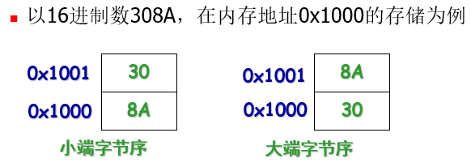


### 套接字支持多种通信协议

1. AF_LOCAL：Unix 系统本地通信

2. AF_INET：IP版本4

3. AF_INET6：IP版本6


### 套接字类型

套接字类型：是指创建套接字的应用程序所希望的通信服务类型。

1. SOCKET_STREAM：双向可靠数据流，流式套接字，对应TCP

2. SOCKET_DGRAM：双向不可靠数据报，数据包套接字，对应UDP

3. SOCKET_RAW：是低于传输层的低级协议或物理网络直接访问，可以访问内部网络接口。原始套接字，例如接收和发送ICMP报。


### 套接字地址结构

#### IPv4

```c
typedef  uint32_t  in_addr_t;         // 4字节
typedef  uint16_t  in_port_t;         // 2字节
typedef  unsigned short sa_family_t;  // 2字节

struct  in_addr{
   in_addr_t  s_addr;        // 32位IP地址，网络字节序
};

struct sockaddr_in{
  uint8_t sin_len;             /* IPv4地址长度 */ // 1字节
  sa_family_t sin_family;      /* 地址类型 */     // 2字节
  int_port_t sin_port;         /* 存储端口号 */   // 2字节
  struct in_addr sin_addr;     /*存储IP地址 */    // 4字节
  unsigned char sin_zero[8];   /* 空字节 */       // 1字节
}
```

```c
struct sockaddr_in server
……
// 初始化
bzero(&server,sizeof(server))//置0
server.sin_family=AF_INET; 
server.sin_port=htons(PORT); 
server.sin_addr.s_addr = htonl(INADDR_ANY)
……

// 设置地址信息的实例（IPv4）
struct sockaddr_in mysock;      /*设置sockaddr_in的结构体变量mysock */
mysock.sin_family=AF_INET;      /*地址族*/
mysock.sin_port=htons(3490);    /*short,NBO*/
mysock.sin_addr.s_addr=inet_addr(“192.168.1.221”); /*设置地址为192.168.1.221*/
bzero(&(mysock.sin_zero),8); /*设置sin_zero为8位保留字节*/

// 注意：如果mysock.sin_addr.s_addr=INADDR_ANY,则不指定IP地址（用于server程序）。
```

#### IPv6

```c
typedef  uint16_t  in_port_t;
typedef  unsigned short  sa_family_t;

struct  in6_addr{
   uint8_t	s6_addr[16];
};

struct  sockaddr_in6{
   uint8_t  	  sin6_len;       // 1字节
   sa_family_t	  sin6_family;    // 2字节
   in_port_t	  sin6_port;      // 2字节
   uint32_t	  sin6_flowinfo;      // 4字节
   struct  in6_addr  sin6_addr;   // 16字节
};
```

sin6_flowinfo成员分成三个字段：

1. 低24位是流量标号；

2. 下4位是优先级；

3. 再下4位保留

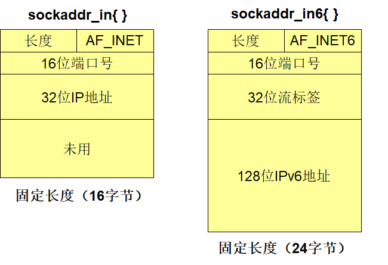


#### 通用套接字地址结构

```c
struct  sockaddr{
   uint8_t  	  sa_len;     // 1字节
   sa_family_t	  sa_family;  // 2字节
   char		  sa_data[14];    // 14字节
};

```


### 字节排序函数

```c
unsigned short int htons(unsigned short int hostshort); 
unsigned long int htonl(unsigned long int hostlong);
unsigned short int ntohs(unsigned short int netshort);
unsigned long int ntohl(unsigned long int netlong);
// h:主机  n:网络  s:短整数   l:长整数
// 其中:
// 前两个函数将主机字节顺序转换成网络字节顺序；
// 后两个函数将网络字节顺序转换成主机字节顺序。
```


### 字节操纵函数

```c
// 将目标中指定数目的字节置为0，经常用此函数来对套接字进行初始化
void bzero(void *dest, size_t nbytes);

// 将指定数目的字节从源拷贝到目标
void bcopy(const void *src, void *dest, size_t nbytes);

// 比较源和目标两个字符串，返回0则相同，非0不相同
int bcmp(const void *src, void *dest, size_t nbytes); 
 
// 将目标指定数目的字节置为值c
void *memset(void *dest, int c, size_t len);

// 和bcopy差不多，但交换了源和目标指针参数的位置。当源与目标重迭时，bcopy 函数能正确处理，而 memcpy 函数的操作结果则是不可知的。
void *memcpy(void *dest, const void *src, size_t nbytes);

// 比较源和目标两个字符串，返回0则相同，非0不相同。如果dest所指字节大于src，则返回值大于0，否则返回值小于0
int memcmp(const void *dest, const void *src, size_t nbytes)
```


### IP 地址转换函数

```c
// 点分十进制 -> 二进制
// inet_addr函数，其转换结果作为返回值返回32位二进制网络字节序地址，若转换错，则返回INADDR_NONE。inet_addr进行相同的转换，但不进行有效性验证，
in_addr_t inet_addr(const char *strptr);

// 点分十进制 -> 二进制
// inet_aton函数将strptr所指向的字符串转换成32位的网络字节序二进制值，并存储在指针addrptr指向的in_addr结构体中，若成功，返回1。
int inet_aton(const char *strptr, struct in_addr *addrptr);

// 二进制 -> 点分十进制
// 返回：指向点分十进制数串的指针, 函数inet_ntoa将32位的网络字节序二进制IPv4地址转换成相应的点分十进制数串。但由于返回值所指向的串留在静态内存中，这意味着函数是不可重入的。
char *inet_ntoa(struct in_addr inaddr);

// 字母A和N分别代表ASCII串和numeric（数值格式）。

/* 上面三个方法只能处理IPv4，不能处理IPv6 */

// 点分十进制 -> 二进制
// 返回：1-成功，0－输入无效，-1:出错
// 参数：family 标识是ipv4还是ipv6, strptr点分⼗进制， addrptr转换后的⼆进制地址
int inet_pton(int family, const char *strptr, void *addrptr);

// 二进制 -> 点分十进制
// 返回：指向结果的指针－－成功，NULL－出错
// 参数：family 标识是ipv4还是ipv6, strptr点分⼗进制， addrptr转换后的⼆进制地址
const char *inet_ntop(int family, const void *addrptr, char *strptr, size_t len);
          
// 字母P和N分别代表presentation（地址的表达格式）和numeric（数值格式）。
// 长度参数len是目标的大小，如果太小无法容纳表达格式结果，则返回一个空指针。另外，目标指针调用前必须先由调用者分配空间。
```


###  isfdtype 函数 

测试某个描述符是不是给定的类型。

```c
 #include  int isfdtype(int fd, int fdtype); 

// 为了测试描述符是否是套接字描述符，fdtype 参数应设为 S_IFSOCk。
// 例如： isfdtype(sockfd, S_IFSOCk);
```


## 第三章


### TCP 套接字编程流程

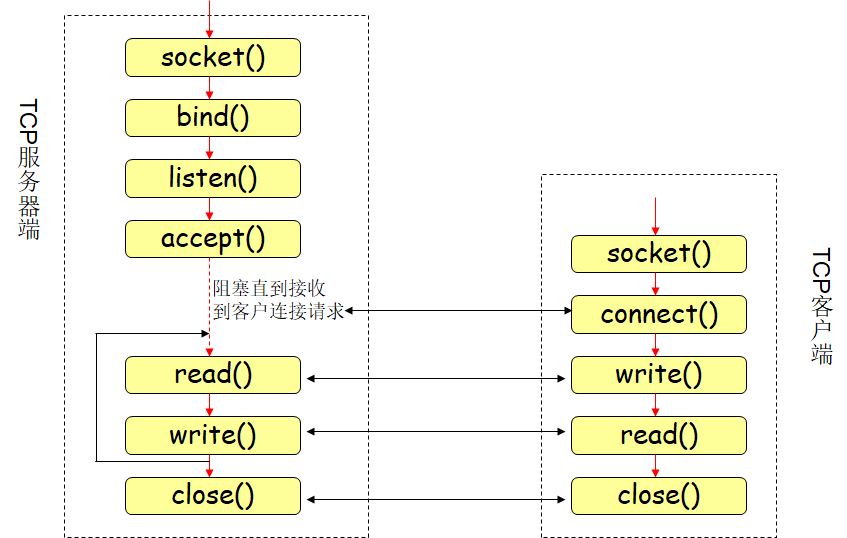

**TCP套接字实现过程**

服务器端步骤:

1. 创建套接字
2. 绑定套接字
3. 设置套接字为监听模式，进入被动接受连接请求状态
4. 接受请求，建立连接
5. 读/写数据
6. 终止连接

客户端步骤:

1. 创建套接字

2. 与远程服务程序连接

3. 读/写数据

4. 终止连接


### 基本函数

#### socket 函数

**为了执行网络输入输出，一个进程必须做的第一件事就是调用socket函数获得一个文件描述符。**

```c
#include <sys/socket.h>

// 返回：非负描述字－－－成功　　-1－－－失败
int socket(int family,int type,int protocol); 　　　

// 第一个参数指明了协议簇，目前支持5种协议簇，最常用的有AF_INET(IPv4协议)和AF_INET6(IPv6协议)
    
// 第二个参数指明套接口类型，有三种类型可选：SOCK_STREAM(字节流套接口)、SOCK_DGRAM(数据报套接口)和SOCK_RAW(原始套接口)

// 如果套接口类型不是原始套接口，那么第三个参数就为0。 
```

```c
// eg
#include <sys/socket.h>
/* Create TCP socket */
/* 
     * int socket(int family, int type, int protocol)
     * family: 协议族
     * type: 产生套接字的类型
     * protocol: 协议标志，一般为0
     */
// TODO 用于生成TCP套接字，生成失败则报错
if ((listenfd = socket(AF_INET, SOCK_STREAM, 0)) == -1)
{
    /* handle exception */
    perror("socket() error.");
    exit(1);
}
```

#### bind 函数

当用socket创建一个套接口后，该套接口还是不能直接使用，因为它只存在于一个名字空间中，也就是只确定了通信所希望使用的服务类型，并没有与该主机上提供服务的某个端口联系在一起，称之为：未命名的套接口。

**bind()函数通过给一个未命名套接口分配一个本地名字来为套接口建立本地捆绑（主机地址/端口号）。**

```c
// 返回：0－成功；-1－出错并置errno
#include <sys/socket.h>
int bind(int sockfd, const struct sockaddr *addr, socklen_len len)
                                 
// 该函数指明套接字将使用本地的哪一个协议端口进行数据传送（IP地址和端口号）
// 注意：协议地址addr是通用地址。
    
// Len是该地址结构（第二个参数）的长度。

// 一般而言，服务器调用此函数，而客户则很少调用它？？？
// 因为：客户端是主动向服务器发出请求的，客户开始发送数据，系统就给客户端分配一个随机的端口，这个端口和客户端的IP会随着数据一起发给服务器，服务器就可以从中或得客户的IP和端口，接下来服务器就可以利用获得的IP和端口给客户端回应消息。
```

绑定地址时，可以指定地址和端口号，也可以指定其中之一，甚至一个也不指定。通配地址：INADDR_ANY，其值一般为0，它通知内核选择IP地址。

另外，需要注意以下几点：

1. 参数addr中的相关字段在初始化时，必须是网络字节序；

2. 如果由内核来选择IP地址和临时端口号，函数并不返回所选择的值。为了获得这些值，进程必须调用getsockname函数getsockname(int sockfd, struct sockaddr *localaddr, socklen_t *localaddrlen); 

3. 函数bind返回的一个常见错误是：所绑定的地址已被其它进程使用，此时errno的值为EADDRINUSE， 我们可以通过设置套接字选项SO_REUSEADDR。

#### setsockopt 函数

```c
// 返回：0－OK；-1－出错
#include <sys/socktet.h>
int setsockopt(int sockfd, int level, int optname, const void *optval, socklen_t optlen);
                                  
// 该函数用于任意类型、任意状态套接口的设置选项值，尽管在不同协议层上存在选项，但本函数定义了最高的“套接口”层次上得选项。选项影响套接口的操作，诸如：广播数据是否可以从套接口发送等等。

// sockfd 必须指向一个打开的套接字描述字。

// Level 是选项所在的层及协议，有如下值:
// SOL_SOCKET (通用套接字 )
// IPPROTO_TCP(传输层，TCP协议)
// IPPROTO_IP(网际层，IP协议)

// Optname是所要操作的选项名。(SO_、IP_、TCP_是选项名的前缀，不同的level有不同的前缀。)

// optval是一个指向变量的指针，通过它设置选项的新值，此变量的大小由最后一个参数指定
```


```c
// eg
/* set socket option */
// TODO 允许地址重用
int opt = SO_REUSEADDR;
setsockopt(listenfd, SOL_SOCKET, SO_REUSEADDR, &opt, sizeof(opt));

// TODO 先将server置0
bzero(&server, sizeof(server));

// TODO 初始化server
server.sin_family = AF_INET;
server.sin_port = htons(PORT);
server.sin_addr.s_addr = htonl(INADDR_ANY);

/* 
     * int bind(int sockfd, const struct sockaddr *server, socklen_len addrlen)
     * sockfd: 套接字函数返回的套接字描述符
     * server: 特定协议的地址结构指针
     * addrlen: 指定了该套接字地址结构长度
*/
// TODO 用于调用socket函数产生的套接字，分配一个本地协议地址，建立地址与套接字之间的关系
if (bind(listenfd, (struct sockaddr *)&server, sizeof(server)) == -1)
{
    /* handle exception */
    perror("Bind() error");
    exit(1);
}
```

#### listen 函数

listen函数仅被TCP服务器调用，它的作用是将用sock创建的主动套接口转换成被动套接口，并等待来自客户端的连接请求。

```c
// 返回：0－－－成功　　　-1－－－失败
#include <sys/socket.h>
int listen(int sockfd,int backlog); 

// 第一个参数是socket函数返回的套接口描述字；
// 第二个参数规定了内核为此套接口排队的最大连接个数。

// 由于listen函数第二个参数的原因，内核要维护两个队列：已完成连接队列和未完成连接队列。
// 未完成队列中存放的是TCP连接的三路握手为完成的连接，accept函数是从已连接队列中取连接返回给进程；当以连接队列为空时，进程将进入睡眠状态。 
```

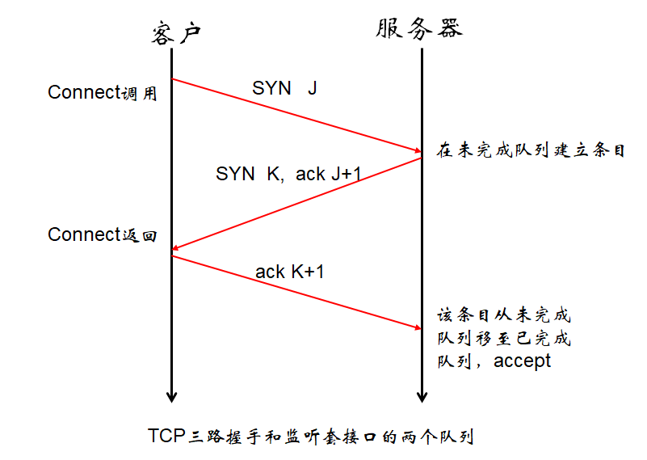

```c
/* 
* int listen(int sockfd, int backlog)
* sockfd: 套接字函数返回的套接字描述符
* backlog: 规定请求队列中最大连接的个数
*/
// TODO 开始监听，指示内核应该接受发向套接字的请求
if (listen(listenfd, BACKLOG) == -1)
{
    perror("listen() error.\n");
    exit(1);
}
```

#### accept 函数

```c
// 返回：非负描述字（connfd）－OK；-1－出错；
#include <sys/socket.h>
int accept(int sockfd, struct sockaddr *cliaddr, socklen_t *addrlen);
             
// accept函数由TCP服务器调用；从已完成连接队列头返回下一个已完成连接；如果该队列空，则进程进入睡眠状态。
// 函数返回的套接字为已连接套接字，应与监听套接字区分开来

// 该函数最多返回三个值：
// 一个既可能是新套接字也可能是错误指示的整数
// 一个客户进程的协议地址（由cliaddr所指），以及该地址的大小（这后两个参数是值－结果参数）；也就是说，服务器可以通过参数cliaddr来得到请求连接并获得成功的客户的地址和端口号；
```


```c
addrlen = sizeof(client);

/* 
* int accept(int listenfd, struct sockaddr *client, socklen_t *addrlen)
* listenfd: 套接字函数返回的套接字描述符
* client: 客户端的套接字地址结构
* addrlen: 客户端的套接字地址结构对应的长度
* return: connectfd, 已连接套接字
*/

// TODO 使服务器接受客户端的连接请求
if ((connectfd = accept(listenfd, (struct sockaddr *)&client, &addrlen)) == -1)
{
    perror("accept() error\n");
    exit(1);
}

```

#### connect 函数

```c
// 返回：0－成功；-1－出错；
#include <sys/socket.h>
int connect(int sockfd, const struct sockaddr *addr, socklen_t addrlen);
             
// 函数connect激发TCP的三路握手过程；仅在成功或出错返回；错误有以下几种情况：
// 如果客户没有收到SYN分节的响应（总共75秒，这之间需要可能需要重发若干次SYN），则返回ETIMEDOUT。
// 如果对客户的SYN的响应是RST，则表明该服务器主机在指定的端口上没有进程在等待与之相连。函数返回错误ECONNREFUSED；
// 如果客户发出的SYN在中间路由器上引发一个目的地不可达ICMP错误，客户上的内核保存此消息，并按第一种情况，连续发送SYN，直到规定时间，返回保存的消息（即ICMP错误）作为EHOSTUNREACH或ENETUNREACH错误返回给进程。
```

客户在调用connect前不必非得调用bind函数，此时，内核会选择一个合适的IP地址和临时端口号；

如果函数connect失败，则套接字不可再用，必须关闭。不能再对此套接字再调用函数connect

```c
// TODO 初始化
bzero(&server, sizeof(server));
server.sin_family = AF_INET;
server.sin_port = htons(PORT);
server.sin_addr = *((struct in_addr *)he->h_addr);

/* 
* int connect(int sockfd, const strust sockaddr *addr, socklen_t addrlen)
* sockfd: 套接字函数返回的套接字描述符
* addr: 指向服务器的套接字地址结构的指针
* addrlen: 服务器指向的套接字地址结构的大小
*/

// TODO 用于建立一个与TCP服务器的连接
if (connect(sockfd, (struct sockaddr *)&server, sizeof(server)) == -1)
{
    printf("connect() error\n");
    exit(1);
}
```

#### close 函数

```c
// 返回:0－OK；-1－出错
include <unistd.h>
int close(int sockfd);

// close函数缺省功能是将套接字做上“已关闭”标记，并立即返回到进程。这个套接字不能再为该进程所用。
```

```c
close(sockfd);
```


#### shutdown 函数

```c
// 返回:0－OK；-1－出错，并置相应的errno的值
#include <sys/socket.h>
int shutdown(int sockfd, int howto);
    
// 该函数立即发送FIN分节（无论其访问计数是否大于0）。shutdown根据参数howto关闭指定方向的数据传输；

//SHUT_RD：关闭连接的读这一半，不再接收套接字中的数据且现留在接收缓冲区的数据作废；

// SHUT_WR ：关闭连接的写这一半（半关闭），当留在套接字发送缓冲区中的数据都被发送，后跟tcp连接终止序列，不管访问计数是否大于0；此后将不能在执行对套接字的任何写操作；

// SHUT_RDWR：连接的读、写都关闭，这等效于调用shutdown两次，一次调用是用
SHUT_RD，第二次用SHUT_WR。

```

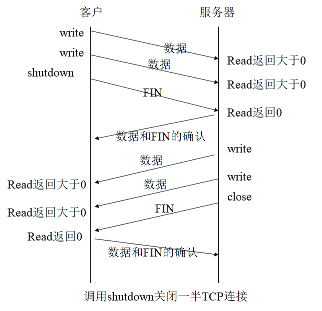

#### close 和 shutdown 的区别

* 使⽤close终止⼀个连接，但它只是减少描述符的引⽤计数，并不直接关闭连接，只有当描述符的引⽤计数为0时才关闭连接。 

* shutdown不考虑描述符的引⽤计数，直接关闭描述符。也可选择终止⼀个⽅向的连接，只终止读或只终止写。

#### read 函数

```c
// 返回:大于0－读写字节大小；-1－出错；
// tcp协议收到FIN数据，返回0；

#include <unistd.h>
int read(int fd, char *buf, int len);

/* 
* int read(int sockfd, char *buf, int len)
* sockfd: 已连接描述符
* buf: 指向一个用于接受信息的数据缓存区
* len: 接受信息的数据缓存区的大小
* return: 调用成功返回大于0的整数，也就是接受的字节数，出错返回-1
*/   
```

#### write 函数

```c
// 返回:大于0－读写字节大小；-1－出错
#include <unistd.h>
int write(int fd, char *buf, int len);     

/* 
 * int write(int sockfd, const void *buf, int len)
 * sockfd: 已连接描述符
 * buf: 指向一个用于发送数据的数据缓存区
 * len: 发送数据的数据缓存区的大小
 * return: 调用成功返回大于0的整数，也就是发送的字节数，出错返回-1
*/   

```

#### send 函数

```c
// 返回：非0－发送成功的数据长度；-1－出错
#include <sys/types.h>
#include <sys/socket.h>
ssize_t send (int fd, const void *msg, size_t len, int flags);

/* 
         * ssize_t send(int sockfd, const void *buf, size_t len, int flags)
         * sockfd: 已连接描述符
         * buf: 指向一个用于发送数据的数据缓存区
         * len: 发送数据的数据缓存区的大小
         * flags: 传输控制标志，0为常规操作，和write功能一致
         * return: 调用成功返回大于0的整数，也就是发送的字节数，出错返回-1，ssize_t就等于int类型
*/   

// TODO 发送数据
if (send(sockfd, buf, strlen(buf), 0) == -1)
{
    perror("Send error!\n");
    exit(0);
}
```

#### recv 函数

```c
// 返回：大于0表示成功接收的数据长度；0: 对方已关闭，-1:出错
#include <sys/types.h>
#include <sys/socket.h>
ssize_t recv(int fd, void *buf ,size_t len, int flags);

/* 
* ssize_t recv(int sockfd, char *buf, int len, int flags)
* sockfd: 已连接描述符
* buf: 指向一个用于接受信息的数据缓存区
* len: 接受信息的数据缓存区的大小
* flags: 传输控制标志，0为常规操作，和read功能一致
* return: 调用成功返回大于0的整数，也就是接受的字节数，出错返回-1，ssize_t就等于int类型
*/   

// TODO 接受数据
if ((num = recv(sockfd, buf, MAXDATASIZE, 0) == -1))
{
    perror("Recv error!\n");
    exit(0);
}
```


### 域名解析函数 gethostbyname

```c
// 作用：通过域名获得IP地址，也可以直接写点分十进制的ip地址
// 返回：非空指针－成功；空指针－出错，同时设置h_error
#include <netdb.h>
struct hostent *gethostbyname(const char *hostname)
  
// 该函数既可解析IPv4地址，也可解析IPv6地址；
// 该函数既可接收域名，也可接收点分十进制参数
// 当hostname为点分十进制时，函数并不执行网络查询，而是直接将其拷贝到结果字段中。
// 此函数返回的非空指针指向下面的hostent结构

struct hostent {
	char *h_name;    /* official (canonical) name of host */
	char **h__aliases;/* pointer to array of pointers to alias names */
	int h_addrtype;	/* host address type: AF_INET or AF_INET6 */
	int	h_length;	/* length of address :4 or 16 */
	char **h_addr_list;	/* ptr to array of ptrs with IPv4 or IPv6 address */
};

#define h_addr  h_addr_list[0]	/* first address in list */
struct  hostent *he;
*((struct in_addr *)he->h_addr)

```

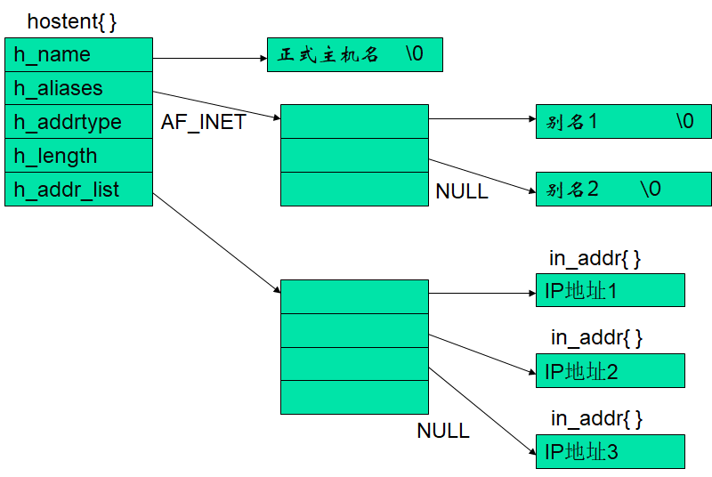

```c
if ((he = gethostbyname(argv[1])) == NULL) 
{
    perror("gethostbyname error.");
    exit(1);
}

if ((fd = socket(AF_INET, SOCK_STREAM, 0)) == -1) 
{
    perror("Create socket failed.");
    exit(1);
}

bzero(&server, sizeof(server));
server.sin_family = AF_INET;
server.sin_port = htons(PORT);
server.sin_addr = *((struct in_addr *) he->h_addr);
```


### TCP套接字编程实例

```c
/*server.c*/
#include <unistd.h>
#include <sys/types.h>
#include <sys/socket.h>
#include <netinet/in.h>
#include <arpa/inet.h>

#define PORT 1234
#define BACKLOG 1

void main() {
  int listenfd, connectfd;
  struct sockaddr_in server;
  struct sockaddr_in client;

  if((listenfd = socket(AF_INET, SOCK_STREAM, 0)) == -1) {
    perror("listen error");
    exit(1);
  }

  int opt = SO_REUSEADDR;
  setsocketopt(listenfd, SOL_SOCKET, SO_REUSEADDR, &opt, sizeof(opt));

  bzero(&server, sizeof(server));
  server.sin_family = AF_INET;
  server.sin_port = htons(PORT);
  server.sin_addr.s_addr = htonl(INADDR_ANY);

  if(bind(listenfd, (struct sockaddr *)&server, sizeof(server)) == -1) {
    perror("bind error");
    exit(1);
  }

  if(listen(listenfd, BACKLOG) == -1) {
    perror("listen error");
    exit(1);
  }

  socklen_t len = sizeof(client);

  if((connectfd = accept(listenfd, (struct sockaddr *)&client, &len)) == -1) {
    perror("accept error");
    exit(1);
  }

  char buf = "hello world";

  send(connectfd, buf, strlen(buf), o);
  
  printf("IP is %s, Port is %d\n", inet_ntoa(client.sin_addr), htons(client.sin_port));

  close(connectfd);
  close(listenfd);
}
```

```c
/*client.c*/
#include <unistd.h>
#include <sys/types.h>
#include <sys/socket.h>
#include <netinet/in.h>
#include <arpa/inet.h>

#define PORT 1234
#define MAXDATASIZE 100

void main(int argc, char *argv[]) {
  int sockfd;
  struct sockaddr_in server;
  struct hostent *he;

  if(argc != 2) {
    printf("Usage: %s<IP Address>\n", argv[0]);
    exit(1);
  }

  if((he = gethostbyname(argv[1])) == NULL) {
    printf("gethostbyname error");
    exit(1);
  }

  if((sockfd = socket(AF_INET, SOCK_STREAM, 0)) == -1) {
    printf("socket error");
    exit(1);
  }

  bzero(&server, sizeof(server));
  server.sin_family = AF_INET;
  server.sin_port = htons(PORT);
  server.sin_addr.s_addr = *((struct in_addr *)he->h_addr);

  if(connect(sockfd, (struct sockaddr *)server, sizeof(server)) == -1) {
    printf("connect error");
    exit(1);    
  }

  char buf[MAXDATASIZE];
  int num;

  if((num = recv(sockfd, buf, MAXDATASIZE, 0)) == -1) {
    printf("recv error");
    exit(1); 
  }

  buf[num-1] = "\0";
  printf("server message: %s\n", buf);
  close(sockfd);
}
```


### 服务器异常的三种情况

1. 服务器主机崩溃
2. 服务器主机崩溃后重启
3. 服务器主机关闭


### UDP套接字编程流程

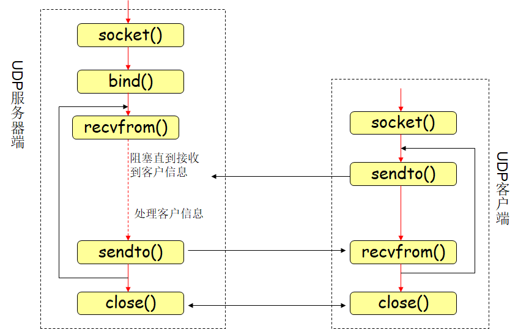

**服务器端：**

①建立UDP套接字；

②绑定套接字到特定地址；

③等待并接收客户端信息；

④处理客户端请求；

⑤发送信息回客户端；

⑥关闭套接字；

**客户端步骤：**

①建立UDP套接字；

②发送信息给服务器；

③接收来自服务器的信息；

④关闭套接字


### 基本函数

#### sendto 函数

```c
// 返回：大于0－成功发送数据长度；-1－出错；
#include <sys/types.h>
#include <sys/socket.h>
ssize_t sendto(int sockfd, const void *msg, size_t len, int flags, const struct sockaddr *to, int tolen);

/* 
         * ssize_t sendto(int sockfd, const void *buf, size_t len, int flags, struct sockaddr *to, int addrlen)
         * sockfd: 监听套接字
         * buf: 指向一个用于发送信息的数据缓存区
         * len: 发送信息的数据缓存区的大小
         * to: 指明数据将发往的协议地址
         * addrlen: 对方的套接字地址结构的字节数
*/

// TODO 发送数据
sendto(sockfd, recvbuf, num, 0, (struct sockaddr *)&client, len);
```

#### recvfrom 函数

```c
// 返回：大于0－成功接收数据长度；-1－出错；
include <sys/types.h>
#include <sys/socket.h>
ssize_t recvfrom(int sockfd, void *buf, size_t len, int flags, struct sockaddr *from, int *fromlen);
         
        /* 
         * ssize_t recvform(int sockfd, void *buf, size_t len, int flags, struct sockaddr *from, size_t *addrlen)
         * sockfd: 监听套接字
         * buf: 指向一个用于接受信息的数据缓存区
         * len: 接受信息的数据缓存区的大小
         * from: 返回与之通信的对方的套接字地址结构，告诉用户接受的数据报来自谁
         * addrlen: 对方的套接字地址结构的字节数
         */

// TODO 接受数据
num = recvfrom(sockfd, recvbuf, MAXDATASIZE, 0, (struct sockaddr *)&client, &addrlen);
```


### UDP 套接字编程实例

```c
/*server.c*/
#include <stdio.h>
#include <string.h>
#include <stdlib.h>
#include <sys/socket.h>
#include <netinet/in.h>
#include <arpa/inet.h>
#include <unistd.h>

#define PORT 1234
#define MAXDATASIZE 100

void main() {
  int sockfd;
  struct sockaddr_in server;
  struct sockaddr_in client;

  if((sockfd = socket(AF_INET, SOCK_DGRAM, 0)) == -1) {
    printf("socket error");
    exit(1);
  }

  // UDP不用设置地址重用
  // int opt = SO_REUSEADDR;
  // setsocketopt(sockfd, SOL_SOCKET, SO_REUSEADDR, &opt, sizeof(opt));

  bzero(&server, sizeof(server));
  server.sin_family = AF_INET;
  server.sin_port = htons(PORT);
  server.sin_addr.s_addr = *((struct in_addr *)he->h_addr);

  if(bind(sockfd, (struct sockaddr *)server, sizeof(server)) == -1) {
    printf("bind error");
    exit(1);    
  }

  char buf[MAXDATASIZE];
  socklen_t len = sizeof(client);
  int num;

  while(1) {
    num = recvfrom(sockfd, buf, MAXDATASIZE, 0, (struct sockaddr *)&client, &len);
    if (num < 0) {
      printf("recvfrom error");
      exit(1);        
    }

    buf[num-1] = "\0";
    printf("IP is %s, Port is %d\n", inet_ntoa(client.sin_addr), htons(client.sin_port));

    sendto(socket, "hello world", 11, 0, (struct sockaddr *)client, len);
    if(!strcmp(buf, "bye")) {
      break;
    }
  }

  close(sockfd);
}
```

```c
/*client.c*/
#include <stdio.h>
#include <netdb.h> 
#include <sys/socket.h>
#include <stdlib.h>
#include <string.h>
#include <netinet/in.h> 
#include <unistd.h>

#define PORT 1234
#define MAXDATASIZE 100

void main(int argc, char *argv[]) {
  int sockfd;
  struct sockaddr_in server;
  struct sockaddr_in peer;
  struct hostent *he;

  if(argc != 3) {
    printf("Usage: %s<IP Address> <Message>\n", argv[0]);
    exit(1);
  }

  if((he = gethostbyname(argv[1])) == NULL) {
    printf("gethostbyname error");
    exit(1);    
  }

  if((sockfd = socket(AF_INET, SOCK_DGRAM, O)) == -1) {
    printf("socket error");
    exit(1);      
  }

  bzero(&server, sizeof(server));
  server.sin_family = AF_INET;
  server.sin_port = htons(PORT);
  server.sin_addr.s_addr = *((struct in_addr *)he->h_addr);

  sendto(sockfd, argv[2], strlen(argv[2]), 0, (struct sockaddr *)&server, strlen(server));

  socklen_t len = sizeof(peer);
  char buf[MAXDATASIZE];
  int num;

  while(1) {
    if((num = recvfrom(sockfd, buf, MAXDATASIZE, 0, (struct sockaddr *)&peer, &len)) == -1) {
      printf("recvfrom error");
      exit(1);   
    }

    if(len != sizeof(server) || memcmp((const *void)&server, (const void *)&peer, len) != 0) {
      continue;
    }

    bum[num] = '\0';
    printf("Sever Message: %s\n", buf);
    break;
  }

  close(sockfd);
}
```


## 第四章


### *服务器的分类

**按连接类型分类：**

1. 面向连接的服务器（如tcp）

2. 面向无连接的服务器（如udp）

**按处理方式分类：**

1. 迭代服务器（重复性服务器）

2. 并发服务器

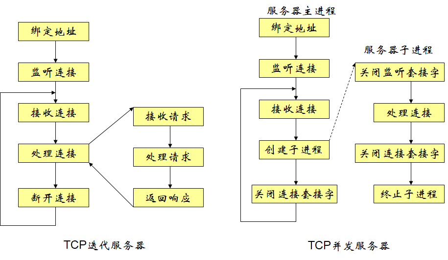


### 进程

1. 程序：存放在磁盘文件中可执行文件。

2. 进程：程序的执行实例。它是一个动态实体，是独立的任务。是“执行中的程序”。程序是一个没有生命的实体，只有处理器赋予程序生命时，它才能成为一个活动的实体，我们称其为进程。

3. 它拥有独立的地址空间、执行堆栈、文件描述符等,一般情况下，包括代码段、数据段和堆栈段。


1. 数据段：存放全局变量、常数以及动态数据分配的空间（malloc函数取得的空间）

2. 代码段：存放程度代码；

3. 堆栈段：存放子程序的返回地址、子程序参数以及程序的局部变量。


### *进程相关函数

#### *fork 函数

```c
// 返回：父进程中返回子进程的进程ID, 子进程返回0，-1－出错
#include <sys/types.h>
#include <unistd.h>
pid_t fork(void)

// 该函数调用一次，但返回两次。两次返回的区别是子进程返回值是0，而父进程的返回值则是子进程的进程ID。
```

父进程中调用fork函数，在fork函数中开始的代码中首先创建一个子进程空间，然后逐步将数据段以及堆栈都拷贝过去，因为子进程的数据段以及堆栈都和父进程一样，而且创建完成后就会和父进程共享代码段，共同执行代码，所以fork创建完子进程后面的代码在子进程中也会执行，并且堆栈中也有fork函数等待返回。

fork后，子进程和父进程继续执行fork（）函数后的指令，两者相互争夺系统资源，一般来说，在fork之后是父进程先执行还是子进程先执行是不确定的，这取决于内核所使用的调度算法。

父进程中调用fork之前打开的所有描述字在函数fork返回之后子进程会得到一个副本。fork后，父子进程均需要将自己不使用的描述字关闭，有两方面的原因：（1）以免出现不同步的情况；（2）最后能正常关闭描述字

```c
// 示例
#include<stdlib.h>
#include<stdio.h>

int main(void)
{
    pid_t   pid;
    int status;
    if ((pid = fork()) == 0)
    {
        // sleep(2);
        printf("child running.\n");
        printf("child sleeping.\n");
       	// sleep(2);
        printf("child dead.\n");
        exit(0);
    } else if ( pid > 0)
    {
        printf("parent running .\n");
	   	printf("parent exit\n");
        exit(0);
    }  else {
        printf("fork error.\n");
        exit(1);
    }
}
```


#### *vfork 函数

```c
// 返回：父进程中返回子进程的进程ID, 子进程返回0，-1－出错
#include <sys/types.h>
#include <unistd.h>
pid_t  vfork(void);
```

**是完全共享的创建，新老进程共享同样的资源，完全没有拷贝。**

当使用vfork()创建新进程时，父进程将被暂时阻塞，而子进程则可以借用父进程的地址空间。**这个奇特状态将持续直到子进程退出，或者调用execve()函数，至此父进程才继续执行。** 因此，子进程需小心处理共享变量。

```c
#include <sys/types.h>
#include <unistd.h>

int main(void)   {
    pid_t pid;
    int status;
    if ((pid = vfork()) == 0){
        sleep(2);
        printf("child running.\n");
        printf("child sleeping.\n");
        sleep(2);
        printf("child dead.\n");
        exit(0);
    }else if ( pid > 0)
    {
        printf("parent running .\n");
	    wait(&status);
	    printf("parent exit\n");
        exit(0);
    }  else    {
        printf("fork error.\n");
        exit(1);
    }
}
```


#### exit 函数

```c
// 本函数终止调用进程。关闭所有子进程打开的描述符，向父进程发送SIGCHLD信号，并返回状态。
#include <stdlib.h>
void exit(int status);
```


### *多进程sleep会影响进程执行的顺序


### *终止进程

**进程的终止存在两个可能：**

1. 父进程先于子进程终止

   init进程领养，在一个进程终止时，系统会逐个检查所有活动进程，判断这些进程是否是正要终止的进程的子进程，如果是，则该进程的父进程就更改为1（init的ID）。保证每个进程都有一个父进程。

2. 子进程先于主进程终止

   系统内核为子进程保留一定的状态信息：进程ID、终止状态、CPU时间等；当父进程调用wait或waitpid函数时，获取这些信息，同时系统内核可以释放终止进程所使用的存储空间等；

   当子进程正常或异常终止时，系统内核向其父进程发送SIGCHLD信号；缺省情况下，父进程忽略该信号，或者提供一个该信号发生时即被调用的函数。

**僵尸进程：**

指一个已经终止，但其父进程尚未对其进行善后处理的进程。


### *获取子进程终止信息

#### *wait 函数

```c
// 返回：终止子进程的ID－成功；-1－出错
// stat_loc存储子进程的终止状态（一个整数）；
#include <sys/types.h>
#include <sys/wait.h>
pid_t wait(int *stat_loc);
```

**如果没有终止的子进程，但是有一个或多个正在执行的子进程，则该函数将阻塞，直到有一个子进程终止或者wait被信号中断时，wait返回。**

当调用该函数时，如果有一个子进程已经终止，则该系统调用立即返回，并释放子进程所有资源。

**使用wait（）函数可能会出现一个问题：**

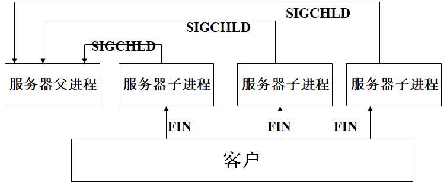


由于linux信号不排队，在SIGCHLD信号同时到来后，信号处理程序中调用了wait函数，其只执行一次，这样将留下2个僵尸进程。可以使用waitpid函数解决这个问题。

#### *waitpid 函数

```c
// 返回：终止子进程的ID－成功；-1－出错
// stat_loc存储子进程的终止状态；
pid_t waitpid(pid_t pid, int *stat_loc, int options);
         
// 当pid=-1,option=0时，该函数等同于wait，否则由参数pid和option共同决定函数行为，其中pid参数意义如下：
// -1：要求知道任何一个子进程的返回状态（等待第一个终止的子进程）；
// >0：要求知道进程号为pid的子进程的状态；
// <-1:要求知道进程号为pid的绝对值的子进程的终止状态 
// Options最常用的选项是WNOHANG,它通知内核在没有已终止进程时不要阻塞。
```


**调用wait或waitpid函数时，正常情况下，可能会有以下几种情况：**

1. 阻塞（如果其所有子进程都还在运行）

2. 获得子进程的终止状态并立即返回（如果一个子进程已终止，正等待父进程存取其终止状态）

3. 出错立即返回（如果它没有任何子进程）

   

```c
// 例子
#include <unistd.h>
#include <sys/types.h>
#include <sys/wait.h>
int main(void)
{
  pid_t pid;
  int status;
  if ((pid = fork()) == 0)
  {
    sleep(1);
    printf("child running.\n");
    printf("child sleeping.\n");
    printf("child dead.\n");
    exit(0);
  }
  else if (pid > 0)
  {
    printf("parent running .\n");
    waitpid(pid, &status, 0);
    printf("parent is running\n");
    printf("parent exit\n");
  }
  else
  {
    printf("fork error.\n");
    exit(1);
  }
}
```


### *多进程并发服务器编程的流程

#### *状态图

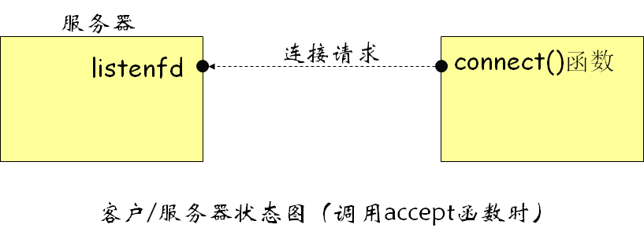

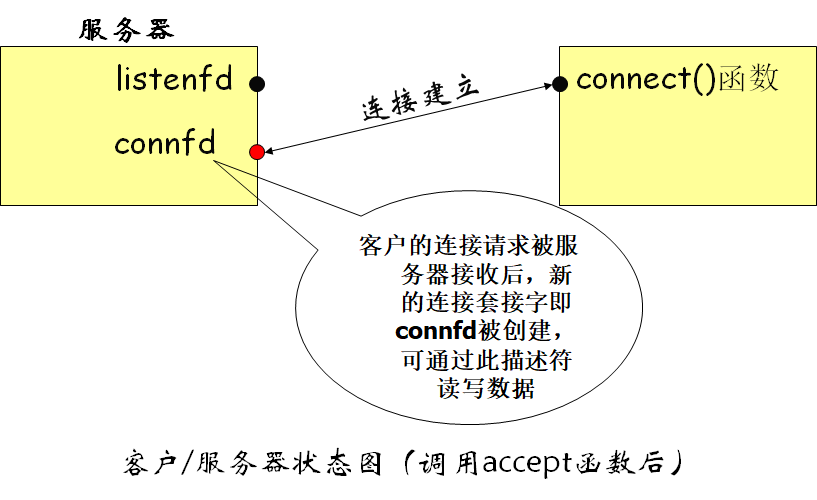

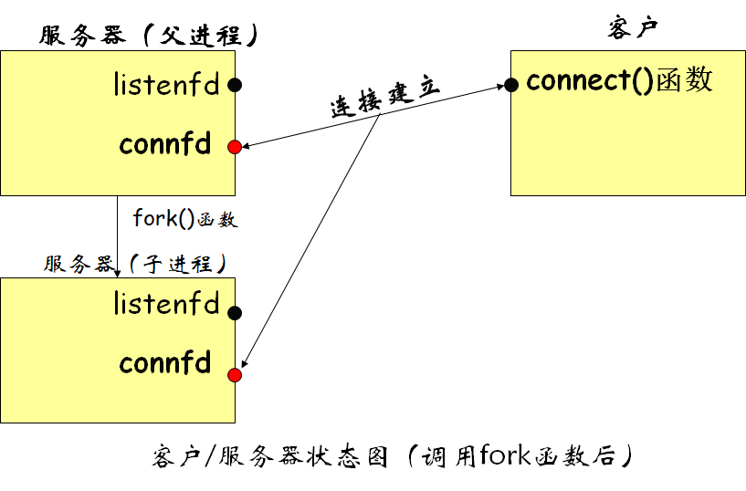

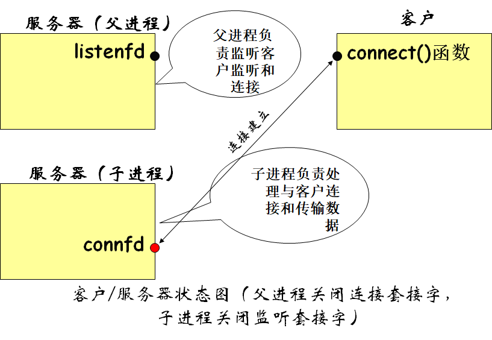

#### *多进程并发服务器建立过程

建立连接 -> 服务器调用fork()产生新的子进程 -> 父进程关闭连接套接字，子进程关闭监听套接字 -> 子进程处理客户请求，父进程等待另一个客户连接

#### *说明

**产生新的子进程后，父进程要关闭连接套接字，而子进程要关闭监听套接字，主要原因是：**

1. 关闭不需要的套接字可节省系统资源，同时可避免父子进程共享这些套接字可能带来的不可预计的后果

2. 另一个更重要的原因，是为了正确地关闭连接。和文件描述符一样，每个套接字描述符都有一个“引用计数”。当fork函数返回后，listenfd和connfd的引用计数变为2，而系统只有在某描述符的“引用计数”为0时，才真正关闭该描述符。

   

### *多进程并发服务器实例

```c
#include <stdio.h>
#include <stdlib.h>
#include <string.h>
#include <strings.h>
#include <unistd.h>
#include <sys/types.h>
#include <sys/socket.h>
#include <netinet/in.h>
#include <arpa/inet.h>

#define PORT 1234
#define BACKLOG 5

void process_cli(int connectfd, struct sockaddr_in client);

void main() {
  int listenfd, connectfd;
  struct sockaddr_in server;
  struct sockaddr_in client;
  pid_t pid;

  if((listenfd = socket(AF_INET, SOCK_STREAM, 0)) == -1) {
    printf("socket error");
    exit(1);
  }

  int opt = SO_REUSEADDR;
  setsocketopt(listenfd, SOL_SOCKET, SO_REUSEADDR, &opt, sizeof(opt));

  bzero(&server, sizeof(server));
  server.sin_family = AF_INET;
  server.sin_port = htons(PORT);
  server.sin_addr.s_addr = htonl(INADDR_ANY);

  if(bind(listenfd, (struct sockaddr *)&server, sizeof(server)) == -1) {
    printf("bind error");
    exit(1);
  }

  if(listen(listenfd, BACKLOG) == -1) {
    printf("listen error");
    exit(1);
  }

  socklen_t len = sizeof(client)

  while(1) {

    if((connectfd = accept(listenfd, (struct sockaddr *)&client, &len)) == -1) {
      printf("accept error");
      exit(1);
    }

    if((pid = fork()) > 0) {
      close(connectfd);
      continue;
    } else if (pid == 0) {
      close(listenfd);
      process_cli(connectfd, client);
      exit(0);
    } else {
      printf("fork error")
      exit(0);
    }

    close(listenfd);
  }
}

void process_cli(int connectfd, struct sockaddr_in client)
{
  int num;
  char recvbuf[MAXDATASIZE], sendbuf[MAXDATASIZE], cli_name[MAXDATASIZE];
  printf("You got a connection from %s.\n", inet_ntoa(client.sin_addr));
  num = recv(connectfd, cli_name, MAXDATASIZE, 0);
  if (num == 0)
  {
    close(connectfd);
    printf("client disconnected.\n");
    return;
  }
  cli_name[num] = '\0';
  printf("Client name is %s.\n", cli_name);
  while (num = recv(connectfd, recvbuf, MAXDATASIZE,0)) {
    recvbuf[num] = '\0';
    printf("Received client(%s) message: %s\n", cli_name, recvbuf);
    for (int i = 0; i < num; i++) {
      sendbuf[i] = recvbuf[num - i - 1];
    }
    sendbuf[i] = '\0';
    send(connectfd, sendbuf, strlen(sendbuf), 0);
	}
	close(connectfd);
}
```


### 多进程服务器的问题

传统的网络服务器程序大都在新的连接到达时，fork一个子进程来处理。虽然这种模式很多年使用得很好，但fork有一些问题：

1. fork是昂贵的。fork时需要复制父进程的所有资源，包括内存映象、描述字等；目前的实现使用了一种写时拷贝（copy-on-write）技术，可有效避免昂贵的复制问题，但fork仍然是昂贵的;
2. fork子进程后，父子进程间、兄弟进程间的通信需要进程间通信IPC机制，给通信带来了困难；
   多进程在一定程度上仍然不能有效地利用系统资源;
3. 系统中进程个数也有限制。


### 线程

线程是进程内的独立执行实体和调度单元，又称为“轻量级”进程（lightwight process）；创建线程比进程快10~100倍。一个进程内的所有线程共享相同的内存空间、全局变量等信息（这种机制又带来了同步问题）。


### *线程相关函数

#### pthread_create 函数

```c
// 创建新线程
// 返回：成功时为0；出错时为正的Exxx值
#include <pthread.h>
int pthread_create(pthread_t *tid, const pthread_attr_t *attr, void *(*func)(void *), void *arg);

// 当一个程序开始运行时，系统会创建一个初始线程或主线程的单个线程。额外线程由上述函数创建；

// 新线程由线程id标识：tid

// 新线程的属性attr包括：优先级、初始栈大小、是否应该是守护线程等等

// 线程的执行函数和调用参数分别是：func和arg；

// 由于线程的执行函数的参数和返回值类型均为void *，因此可传递和返回指向任何类型的指针；

// 常见的返回错误值：
// EAGAIN：超过了系统线程数目的限制。
// ENOMEN：没有足够的内存产生新的线程。
// EINVAL：无效的属性attr值。
```

#### pthread_join 函数

```c
// 这个函数是一个线程阻塞的函数，调用它的函数将一直等待到被等待的线程结束为止，
// 返回：成功时为0；出错时为非0
#inlcude <pthread.h>
int pthread_join(pthread_t tid, void **status);

// tid 等待退出线程的线程号
// value_ptr 退出线程的返回值        
```

#### pthread_self 函数

```c
// 返回自己线程的ID
// 返回：调用线程的线程id;
pthread_t pthread_self();
```

#### pthread_detach 函数

```c
// 将指定线程变成分离的
// 返回：成功时为0；出错时为正Exxx值；
#include <pthread.h>
int pthread_detach(pthread_t tid)
            
// 函数将线程分离，它设置线程的内部选项来说明线程退出后，自动释放其使用的资源。分离线程退出时不会报告它们的状态。而联合的线程退出时，会保留线程ID、终止状态。
```

#### pthread_exit

```c
// 终止当前线程并返回状态值
// 无返回值；
#include <pthread.h>
void pthread_exit(void *status); 

// status 指向线程的退出状态
```


### 使线程终止的三种方法

(1) 使用 pthread_exit 函数。 

(2) 启动线程的函数 pthread_create 的第三个参数返回。该返回值就是线程的终止状态。

 (3) 如果进程的 main 函数返回或者任何线程调用了 exit 函数，进程将终止，线程将随之终止。


### 给新线程传递参数

线程产生函数 pthread_create，只能传递一个参数给线程的执行函数。所以当需要传递多个数据时， 需要将所有数据封装在一个结构中，再将该结构传递给执行函数。


### *多线程并发服务器实例

```c
#include <stdio.h>
#include <strings.h>
#include <unistd.h>
#include <sys/types.h>
#include <sys/socket.h>
#include <netinet/in.h>
#include <arpa/inet.h>
#include <pthread.h>

#define PORT 1234
#define BACKLOG 5
#define MAXDATASIZE 1000

void process_cli(int connectfd, struct sockaddr_in client);
void *function(void *arg);
struct ARG
{
  /* data */
  int connectfd,
  struct sockaddr_in client;
};


void main() {
  int listenfd, connectfd;
  struct sockaddr_in server;
  struct sockaddr_in client;
  struct ARG *arg;
  pthread_t tid;

  if((listenfd = socket(AF_INET, SOCK_DGRAM, 0)) == -1) {
    printf("socket error");
    exit(1);
  }

  int opt = SO_REUSEADDR;
  setsocketopt(listenfd, SOL_SOCKET, SO_REUSEADDR, &opt, sizeof(opt));

  bzero(&server, sizeof(server));
  server.sin_family = AF_INET;
  server.sin_port = htons(PORT);
  server.sin_addr.s_addr = htonl(INADDR_ANY);

  if(bind(listenfd, (struct sockaddr *)&server, sizeof(server)) == -1) {
    printf("bind error");
    exit(1);    
  }

  if(listen(listenfd, BACKLOG) == -1) {
    printf("listen error");
    exit(1);    
  }

  socklen_t len = sizeof(client);

  while(1) {

    if((connectfd = accept(listenfd, (struct sockaddr *)&client, &len)) == -1) {
      printf("accept error");
      exit(1);    
    }

    // 给arg指针开辟空间
    arg = (struct ARG *)malloc(sizeof(struct ARG));
    // 给结构体里的数据赋值
    are->connectfd = connectfd;
    memcpy((void *)&arg->client, &client, sizeof(client));

    if(pthread_create(&tid, NULL, function, (void *)arg)) {
      printf("pthread_create error");
      exit(1);    
    }
  }
  close(listenfd);
}

void *function(void *arg) {
  struct ARG *info;
  info = (struct ARG *)arg;
  process_cli(info->connectfd, info->client);
  free(arg);
  pthread_exit(NULL);
}
```


### *线程安全函数

#### 定义

线程安全问题是一个非常复杂的问题。简单地说，就是多个线程在操作共享数据时出现的混乱情况，这种情况可能导致不可预测的后果。

解决线程安全问题的方法主要有两种：

1. 使用线程安全函数：posix定义的以”_r”结尾的函数

2. 使用线程专用数据(TSD)。

   

在linux环境中，用线程专用数据TSD取代静态变量。它类似于全局数据，只不过它是线程私有的，是以线程为界限的。

**TSD是定义线程私有全局数据的唯一方法。**

**每个TSD由进程内唯一的关键字（key）来标识，用这个关键字，线程可以存取线程私有的数据。**


#### 基本函数

##### pthread_key_create 函数

在进程中分配一个键字，关键字是进程内部唯一的，用来标识一个线程专用数据项（每个线程专用数据和这个关键字关联）。这个键对进程中所有的线程都是可见的。刚创建线程，在所有线程中和这个键相关联的值都是NULL。

创建键之后，每个线程都会将一个值（线程专用数据TSD）绑定到该键。这些值特定于线程并且针对每个线程单独维护。 
**key指向创建的关键字；destructor是一个可选的析构函数，用于每个线程终止时调用该析构函数，释放线程绑定（关联）在该键上得内存块。**

当线程结束时并且将非空的值绑定（关联）在这个键上，系统将调用destructor函数，参数就是相关线程与这个键绑定的值。绑定在这个键上的内存块可由destructor函数释放。

```c
// 返回值：正常执行后返回0，否则返回错误码
#include <pthread.h>
int pthread_key_create(pthread_key_t *key, void (* destructor)(void *value));
```

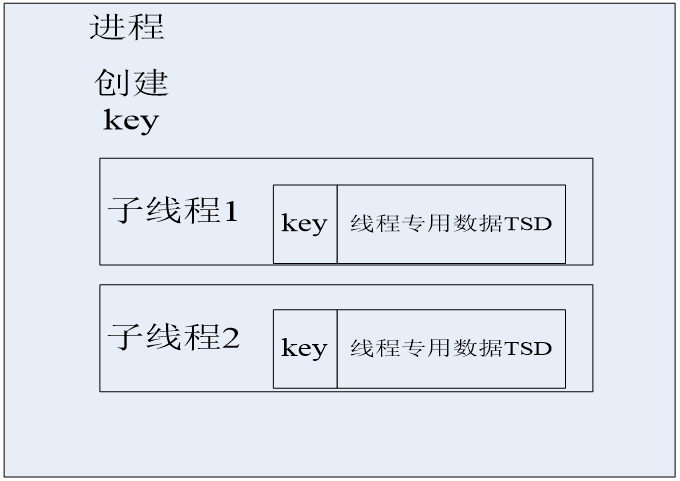

##### pthread_setspecific 和 pthread_getspecific 函数

```c
// 该函数为TSD关键字绑定（关联）一个与本线程相关的值；
// 返回值：正常执行后返回0；否则返回正的错误码
#include <pthread.h>
int pthread_setspecific(pthread_key_t key, const void *value);
    

// 该函数获得与调用线程相关的关键字所绑定的值。
// 返回值：正常执行后返回与调用线程相关的关键字所绑定（关联）的值，否则返回NULL。
void * pthread_getspecific(pthread_key_t key);
```

##### pthread_key_delete

```c
// 该函数删除进程内的TSD表示的关键字。该函数既不检查TSD是否有绑定值，也不调用该关键字的析构函数
// 返回值：成功为0，否则为非0；
int pthread_key_delete(pthread_key_t key);
```

##### pthread_once

```c
// 保证每一个进程只调用一次init函数
// 在本函数中，once_control变量使用的初值为PTHREAD_ONCE_INIT，可保证init_routine()函数在本进程执行序列中仅执行一次
// 成功返回0，否则返回错误码
＃include <pthread.h>
int pthread_once(pthread_once_t *once_control, void (*init_routine) (void))
		                                               
// 一般在init_routine函数中完成一些初始化工作。 
```


### 实现线程安全的两种方法

1. 使用TSD取代静态变量
2. 函数参变量


### 线程安全实例

```c
#include <stdio.h>
#include <strings.h>
#include <unistd.h>
#include <sys/types.h>
#include <sys/socket.h>
#include <netinet/in.h>
#include <arpa/inet.h>
#include <pthread.h>

#define PORT 1234
#define BACKLOG 5
#define MAXDATASIZE 1000

void process_cli(int connectfd, struct sockaddr_in client);
void *function(void *arg);
struct ARG
{
  /* data */
  int connectfd;
  struct sockaddr_in client
};

// TODO [客户处理函数/循环]调用线程安全函数savedata_r(), 将刚刚接收的客户端数据保存到客户缓冲区cli_data中
void savaedata_r(char *recvbuf, int len, char *cli_data);

// TODO 定义TSD关键字变量
pthread_key_t key;
// TODO 定义变量once
pthread_once_t once = PTHREAD_ONCE_INIT;
// TODO 定义析构函数
static void destructor(void *ptr) {
  free(ptr)
}
// TODO 定义函数creatkey_once
static void creatkey_once(void) {
  pthread_key_create(&key, destructor);
}
// TODO 用于存储TSD
struct ST_DATA {
  int index;
}

void main() {
  int listenfd, connectfd;
  struct sockaddr_in server;
  struct sockaddr_in client;
  struct ARG *arg;
  pthread_t tid;

  if((listenfd = socket(AF_INET, SOCK_DGRAM, 0)) == -1) {
    printf("socket error");
    exit(1);
  }

  int opt = SO_REUSEADDR;
  setsocketopt(listenfd, SOL_SOCKET, SO_REUSEADDR, &opt, sizeof(opt));

  bzero(&server, sizeof(server));
  server.sin_family = AF_INET;
  server.sin_port = htons(PORT);
  server.sin_addr.s_addr = htonl(INADDR_ANY);

  if(bind(listenfd, (struct sockaddr *)&server, sizeof(server)) == -1) {
    printf("bind error");
    exit(1);    
  }

  if(listen(listenfd, BACKLOG) == -1) {
    printf("listen error");
    exit(1);    
  }

  socklen_t len = sizeof(client);

  while(1) {

    if((connectfd = accept(listenfd, (struct sockaddr *)&client, sizeof(client))) == -1) {
      printf("accept error");
      exit(1);    
    }

    arg = (struct AGR *)malloc(sizeof(struct AGR));
    arg->connectd = connectfd;
    memcpy((void *)&arg->client, &client, sizeof(client));

    if(pthread_create(&tid, NULL, function, (void *)arg)) {
      printf("pthread_create error");
      exit(1);    
    }
  }
  close(listenfd);
}

void *function(void *arg) {
  struct ARG *info;
  info = (struct ARG *)arg;
  process_cli(info->connectfd, info->client);
  free(arg);
  pthread_exit(NULL);
}

void savaedata_r(char *recvbuf, int len, char *cli_data) {
  struct ST_DATA *data;
  // TODO 产生TSD关键字，只在第一个新线程中执行
  pthread_once(&once, creatkey_once);
  // TODO 如果没有分配空间给TSD， 则分配空间并与TSD关键字绑定
  if ((data = (struct ST_DATA *)pthread_getspecific(key)) == NULL) {
    data = (struct ST_DATA *)malloc(sizeof(struct ST_DATA));
    pthread_setspecific(key, data);
    data->index = 0;
  }
  int i = 0;
  while(i < len-1) {
    cli_data[data->index++] = recvbuf[i];
    i++;
  }
  cli_data[data->index] = '\0';
}
```


## 第五章


### I/O 操作

一个输入操作一般有两个阶段：

1. 等待数据准备好

2. 从内核到进程（应用程序）拷贝数据

对于一个socket上的操作：

1. 一般是等待数据到达网络，当分组到达时，它被拷贝到内核中某个缓冲区。

2. 将数据从内核缓冲区拷贝到应用程序缓冲区


### 五种 I/O 模型

#### 阻塞 I/O

最流行的I/O模型。

缺省时，所有套接字都是阻塞的。阻塞，使进程被挂起而等待I/O的读写就绪。

应用程序调用一个I/O函数，导致应用程序阻塞，等待数据准备好。如果数据没有准备好，一直等待…..数据准备好了，从内核拷贝到用户空间，IO函数成功指示。

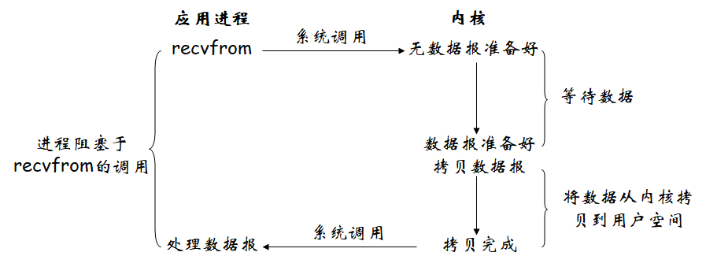

#### 非阻塞 I/O

当把一个套接字设置成非阻塞方式时，即通知内核：当请求的i/o操作不能完成时，不要进程睡眠，而应返回一个错误。这样我们的I/O操作函数将不断的测试数据是否已经准备好，如果没有准备好继续测试。(返回不成功指示) 

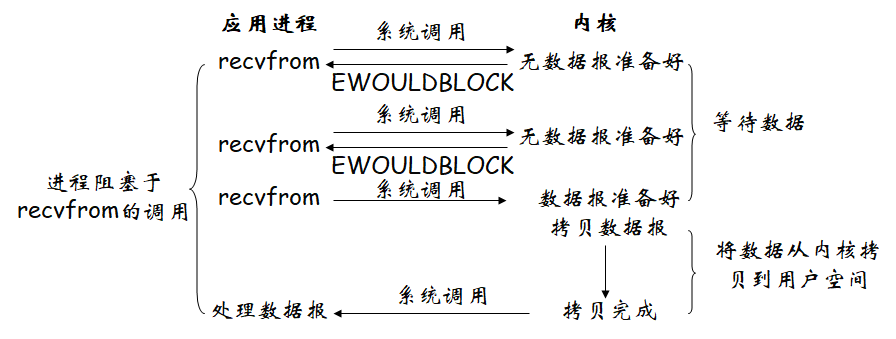

**上述方式循环调用recvfrom，称为轮询，极为浪费cpu资源**

#### I/O 复用（select和poll）

I/O 复用调用 select 或 poll，并在该函数上阻塞，不是阻塞于真正的I/O系统调用上。等待数据报套接口可读，当 select 返回可读条件 时，调用 recvfrom 将数据报拷贝到应用程序缓冲区中。

这两个函数可以同时阻塞多个I/O操作，对多个I/O操作进行检测，直到有数据可读或可写时，才真正调用I/O操作函数。

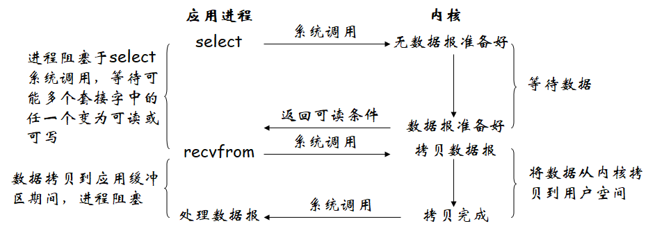

与阻塞I/O模型相比，由于使用了系统调用select，似乎比阻塞I/O还差。但select的好处在于可以等待多个描述字准备好。

#### 信号驱动 I/O （SIGIO）

让内核在描述字准备好时用信号SIGIO通知进程。这种模型的好处是当等待数据报到达时，可以不阻塞。前提是允许套接口进行信号驱动I/O 。

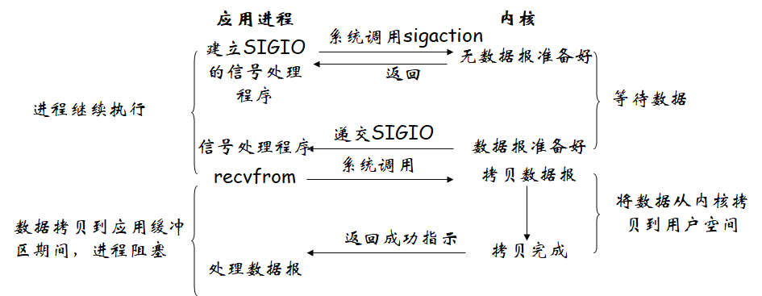

可以由信号处理程序来读取数据，或通知主循环来读取数据。

#### 异步 I/O （posix.1的aio_系列函数)

异步I/O让内核启动操作，并在整个操作完成后（包括将数据从内核拷贝到应用进程的缓冲区）通知我们。

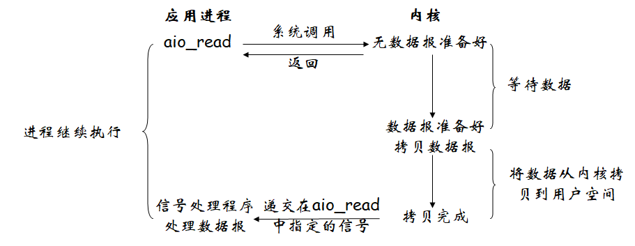

**异步I/O让与信号驱动I/O的区别是：**

后者是由内核通知我们何时可以启动一个I/O操作，而前者是由内核通知我们I/O操作何时完成。

****

### 五个I/O模型的比较


Posix定义这两个术语如下：

同步I/O操作引起请求进程阻塞，直到I/O操作完成；

异步I/O操作不引起请求进程阻塞；

上述I/O模型中，前四个模型：阻塞I/O模型、非阻塞I/O模型、I/O复用模型和信号驱动模型都是同步I/O模型，因为真正的I/O操作（recvfrom）阻塞进程，只有异步I/O模型与此异步I/O定义相匹配。


### select函数

```c
// select()函数允许程序监视多个⽂件描述符，等待所监视的⼀个或者多个⽂件描述符变为“准备好”的状态
// 它允许进程指示内核等待多个事件中的任意一个发生，并仅在一个或多个事件发生或进经过指定的时间时才唤醒进程。
int select(int maxfdp, fd_set *readset, fd_set *writeset,
fd_set *exceptset, struct timeval *timeout);
```

> maxfdp：指定被测试的描述字的个数，它是被测试的最大描述字加 1。 
>
> readset ：监视的读文件描述符集合。
>
> writeset ： 监视的写文件描述符集合
>
> exceptset ：监视的写异常描述符集合
>
> timeout ：调⽤select后，为防⽌陷⼊⽆限阻塞状态，传递超时信息。
>
> 
>
> 成功时：返回三中描述符集合中”准备好了“的⽂件描述符数量。 
>
> 超时：返回0
>
> 错误：返回-1，并设置 errno


> 操作 fd_set ⽤到的宏:
>
> FD_ZERO(fd_set* fdset)：; 将所有位设 0
>
> FD_SET(int fd, fd_set* fdset)：将 fd 位设 1
>
> FD_CLR(int fd, fd_set* fdset)：将 fd 位设 0
>
> FD_ISSET(int fd, fd_set* fdset)：检测 fd 位是否为 1。若参数fd_set指向的变量中包含⽂件描述符fd的信息，则返回1

该函数有三种执行结果：

1. 永远等待下去：仅在有一个或以上描述字准备好I/O才返回，为此，我们将timeout设置为空指针。

2. 等待固定时间：在有一个描述字准备好时返回，但不超过由timeout参数指定的秒数和微秒数。

3. 根本不等待，检查描述字后立即返回，这称为轮询。这种情况下，timeout必须指向结构timeval，且定时器的值必须为0。

在前两种情况的等待中，如果进程捕获了一个信号并从信号处理程序返回，那么等待一般被中断。


### select 函数实现I/O多路复用的步骤

1. 清空描述符集合；

2. 建立需要监视的描述符与描述符集合的联系；

3. 调用 select 函数；

4. 检查所有需要监视的描述符，利用FD_ISSET宏判断是否已准备好；

5. 对已准备好的描述符进行I/O操作。


### select函数实例

```c
#include <stdio.h>
#include <strings.h>
#include <unistd.h>
#include <sys/types.h>
#include <sys/socket.h>
#include <netinet/in.h>
#include <arpa/inet.h>
#include <sys/time.h>
#include <stdlib.h>


// 清空描述符集合
// 建立需要监视的描述符和描述符集合的练习
// 调用select函数
// 检查所有需要监视的描述符，利用FD_ISSET判断是否准备好
// 对已准备好的描述符进行I/O操作

#define PORT 1234
#define BACKLOG 5
#define MAXDATASIZE 1000

// TODO 用来存储客户信息的一个结构
typedef struct CLIENT
{
  int fd;
  char *name;
  struct sockaddr_in addr; /* client's address information */
  char *data;
};

// TODO 处理客户信息的一个结构
void process_cli(CLIENT *client, char *recvbuf, int len);

// TODO 处理存取的数据
void savedata(char *recvbuf, int len, char *data);

void main()
{
  int i, maxi, maxfd, sockfd;
  int nready;
  ssize_t n;
  fd_set rset, allset;
  int listenfd, connectfd;
  struct sockaddr_in server;

  CLIENT client[FD_SETSIZE];
  CHAR recvbuf[MAXDATASIZE];
  int sin_size;

  if ((listenfd = socket(AF_INET, SOCK_STREAM, 0)) == -1)
  {
    perror("socket error");
    exit(1);
  }

  int opt = SO_REUSEADDR;
  setsocketopt(listenfd, SOL_SOCKET, SO_REUSEADDR, &opt, sizeof(opt));

  bzero(&server, sizeof(server));
  server.sin_family = AF_INET;
  server.sin_port = htons(PORT);
  server.sin_addr.s_addr = htonl(INADDR_ANY);

  if (bind(listenfd, (struct sockaddr *)&server, sizeof(server)) == -1)
  {
    perror("bind error");
    exit(1);
  }

  if (listen(listenfd, BACKLOG))
  {
    perror("listen error");
    exit(1);
  }

  sin_size = sizeof(struct sockaddr_in);

  // 当前只有一个 listenfd，没有客户的 connectfd，所以最大 fd 就是 listenfd
  maxfd = listenfd;
  // 当前没有客户，当前最大客户编号为-1（客户编号从 0 开始）
  maxi = -1;
  // FD_SETSIZE 表示一个进程中select所能操作文件描述符的最大数目
  for (i = 0; i < FD_SETSIZE; i++)
  {
    client[i].fd = -1; // 将每个客户的 fd 设置为-1，表示空位，
  }
  FD_ZERO(&allset); // 将所有 fd（包括 1 个 listenfd 和所有客户的 connectfd）置 0
  // 将fd字段为lieten的字段设置成1 
  FD_SET(listenfd, &allset); // 将 listenfd 置 1

  while (1)
  {
    struct sockaddr_in addr;
    rset = allset;

    if((nready = select(maxfd + 1, &rset, NULL, NULL, NULL)) == -1) {
      perror("select error");
      exit(1);
    }

    // TODO 监测listen套接字是否为1, 为1说明有新客户连接
    if (FD_ISSET(listenfd, &rset))
    {
      // 接受客户请求
      if ((connectfd = accept(listenfd, (struct sockaddr *)&addr, &sin_size)) == -1)
      {
        perror("accept error");
        exit(1);
      }
    }

    // 找到空位放客户的connectfd
    for (i = 0; i < FD_SETSIZE; i++) {
      if (client[i].fd < 0) {
        clinet[i].fd = connectfd;
        client[i].name = new char[MAXDATASIZE];
        client[i].addr = addr;
        client[i].data = new char[MAXDATASIZE];
        client[i].name[0] = '\0'; // 客户名字初始为空
        client[i].data[0] = '\0'; // 客户名字数据为空
        printf("You got a connect from %s.", inet_ntoa(client[i].addr.sin_addr));
        break;
      }
    }
    
    // 遍历到最后也没找到空位，说明客户太多，报错
    if (i == FD_SETSIZE) {
      printf("too many clients.\n");
    }
    
    // 将客户的 connectfd 加入 allset 中
    FD_SET(connectfd, &allset);

    // 调整个数
    if (connectfd > maxfd)
      maxfd = connectfd;
    if (i > maxi)
      maxi = i;
    // 如果 select 没有返回更多描述符，说明没有客户数据，直接进入下次循环
    if (--nready < = 0)
      continue;
  }

  // 循环检查所有已经加入的客户
  for (i = 0; i <= maxi; i++)
  {
    // 如果这个客户已经退出，不再检查其是否返回数据，直接检查下一个客户
    if ((sockfd = client[i].fd) < 0)
      continue;
    if (FD_ISSET(sockfd, &rset))
    {
      // 如果读到的客户消息长度为 0，关闭客户连接
      if ((n = recv(sockfd, recvbuf, MAXDATASIZE, 0)) == 0)
      {
        close(sockfd);
        printf("Client(%s) closed connection.User’s data: %s\n", client[i].name, client[i].data);
        FD_CLR(sockfd, &allset);
        client[i].fd = -1;
        delete client[i].name;
        delete client[i].data;
      }
      else // 如果读到的客户消息长度不为 0，处理客户消息
        process_cli(&client[i], recvbuf, n);
      if (--nready <= 0) // 如果 select 没有返回更多描述符，说明没有其他客户数据，不再检查下个客户，直接进入下一次调用 select
        break;
    } /* if (FD_ISSET(sockfd, &rset))  */
  }   /* for(i = 0; i <= maxi; i++)   */
  close(listenfd);
}

// 将收到的客户消息存储到客户数据 client->data 后面
void savedata(char* recvbuf, int len, char* data)
{
  int start = strlen(data);
  for (int i = 0; i < len; i++) {
    data[start + i] = recvbuf[i];
  }
}
```


